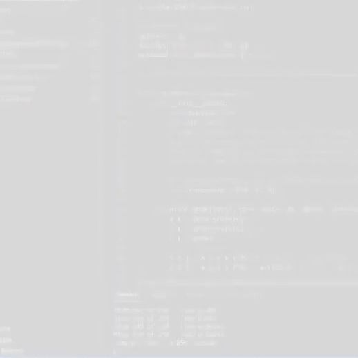
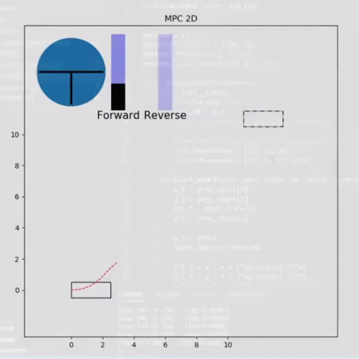
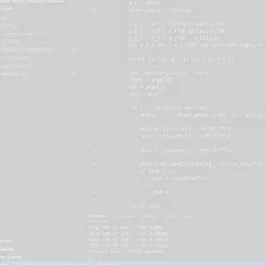

# Model-Predictive-Controllers
Making model predictive controllers for making a Self-Driving or Autonomous Car follow the speed limit, pull into parking spaces, and avoid obstacles.

## Installation and Setup
* Fork the repo and clone it.
```
git clone https://github.com/Frostday/Model-Predictive-Controllers.git
```
* Install the necessary packages required to run the code
```
pip install requirements.txt
```
* To see highway speed control run the following command
```
python -u HighwaySpeedControl.py
```
* To see parking control run the following command
```
python -u ParkingControl.py
```
* To see obstacle avoidance run the following command
```
python -u ObstacleAvoidance.py
```
* If you wanna play around with the simuator then try editing playground.py

## Highway Speed Control
This was the most basic controller, with only two states - x axis position and the speed and only one input - pedal. I designed the cost function to penalize high distances from the goal, overshooting from the goal and also increasing the speed over a given speed limit of 10km/h. 



## Parking Control
This was much more difficult since I had to work with four states - x axis position, y axis position, angle of car and the speed and two inputs - steering wheel and pedal. Here I designed the cost function to penalize distance from the final goal, difference in angle from the angle of the final goal, rapid changes in velocity and steering (so passengers don't get motion sickness). 



## Obstacle Avoidance
Here I again had to work with four states - x axis position, y axis position, angle of car and the speed and two inputs - steering wheel and pedal. I designed the cost function to penalize distance from the final goal, difference in angle from the angle of the final goal and also using if statements I introduced a very high cost term if the vehicle got too close to the obstacle. You might notice that the obstacle is not exactly between the initial position and final goal but slightly above on the y-axis. This is because in an ideal condition if it is directly between the car and the final goal then the optimizer will get confused as it won't be able to decide wether it wants to go above it or below it and hence instead of going around it the optimizer will get stuck and the vehicle will stop right in front of the obstacle. 


